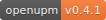

# Adding Badge

The package creator (owner) is encouraged to add the badge to the package GitHub README file.



```html
<a href="https://openupm.com/packages/com.littlebigfun.addressable-importer/">
  
</a>
```

```markdown
[](https://openupm.com/packages/com.littlebigfun.addressable-importer/)
```

To add badge like above
1. Visit the package detail page, and scrolling down to the badge section
2. Click the HTML / markdown link to copy code to clipboard
3. Paste the HTML code to your README file
4. Commit and push to GitHub
