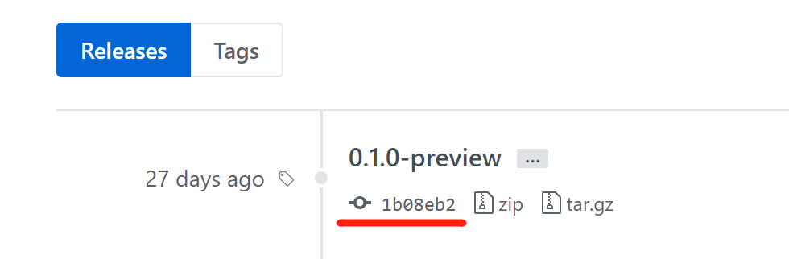
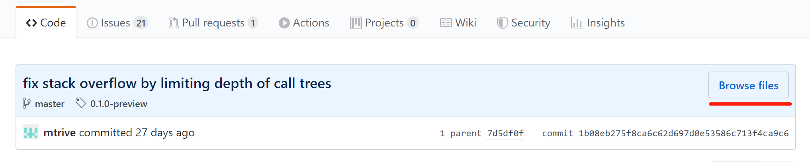

# Adding Upm Package

## Upm Package Criteria

OpenUPM requires the package repository fulfils below criteria
- Containing the required `package.json` of upm package. The `package.json` can be placed at any folder.
- Open source license. It is recommended to choose one from [spdx license list](https://spdx.org/licenses/), especially the one with OSI approved flag. For custom license (or dual licenses), it should be clear whether the package is commercial available.
- Hosting on Github. For now only GitHub repository are supported, but generic git support is under consideration.
- Git tags that conforms valid semver format, with or without the `v` prefix. i.e. `v1.1.0`, `1.1.0`, `1.1.1-preview`, `v2.0.0-preview.1`. Valid tags will be built as package releases. You can create git tags (though GitHub release feature) after adding a repository to the system.

## Package YAML File

OpenUPM uses a yaml file to describe the package information. Here's an example.

```yaml
# package name
name: com.namespace.unitypackageexample
# package display name
displayName: Unity Package Example
# package description
description: An unity package example
# repository url
repoUrl: 'https://github.com/favoyang/unity-package-example'
# repository branch
repoBranch: master
# parent folder of package.json file
packageFolder: ''
# forked repository url
parentRepoUrl: null
# spdx license id
licenseSpdxId: MIT
# license name
licenseName: MIT License
# list of topic slugs
topics:
  - utility
# package hunter name (github username)
hunter: favoyang
# excluded from package list
excludedFromList: false
```

## Using Package Add Form

Package hunter can use the [package add form](/packages/add/), to add package yaml file to the system easily. The form will guide you to fill necessary information, generate the yaml file, add to GitHub via web page and start a pull request.

[](/packages/add/)

Once the pull request get merged, within a few minutes (for the CI to do the jobs):
- You can visit the package at url `/packages/com.namespace.package-name`.
- The package will be added to build pipelines, and results can be viewed from the **version history** and **build issues** sections on the package detail page.

## Troubleshooting

### Handling Different Folder Structures

There're three typical folder structures of repository.

- Pure upm package
- Upm package at a sub-folder
- Upm package at a sub-folder with upm branch

#### Pure Upm Package

The `package.json` is located at the root path of the master branch, and same for other git tags. This is the simplest case and will just work fine.

```yaml
# repository branch
repoBranch: master
# parent folder of package.json file
packageFolder: ''
```

#### Upm Package at a Sub-folder

The repository is an unity project (with Assets folder). The `package.json` is located at a sub-folder, for example `Assets/package-name` or `Packages/com.namespace.package-name`. The folder structure is same for git tags. You need provide the package folder to make the build pipeline work.

```yaml
# repository branch
repoBranch: master
# parent folder of package.json file
packageFolder: 'Packages/com.namespace.package-name'
```

#### Upm Package at a Sub-folder with Upm Branch

The repository is an unity project (with Assets folder). The `package.json` is located at a sub-folder, for example `Assets/package-name` or `Packages/com.namespace.package-name`. An upm branch is made from the subtree of the package folder, so it can be installed via git url by unity package manager.

Then you need double check the git tags, see if it was made from the upm branch or the master branch. Go to the release tab of the repository, find a release/tag, click on the hash link.



Then tap the `Browse files` button.




- If the git tag is made from upm branch, with a `package.json` file at the root path, then you can use upm as default branch and leave the package folder empty.
  ```yaml
  # repository branch
  repoBranch: upm
  # parent folder of package.json file
  packageFolder: ''
  ```
- If the git tags is made from master branch, where `package.json` file is located at a sub-folder, then you need provide package folder.
  ```yaml
  # repository branch
  repoBranch: master
  # parent folder of package.json file
  packageFolder: 'Packages/com.namespace.package-name'
  ```

### Handling Repository without Releases

If a repository without valid git tags/releases. Then it can be only installed via git url. Please create an issue on the repository for making GitHub releases. The release name (git tag) need to be a valid semver. A common practice is naming the release name (git tag) as semver with prefix `v`. i.e. `v1.0.0` for version `1.0.0`.

### Handling Custom Build Script

The build pipeline simply run `npm publish` on the package folder to bundle and publish package. If what you want is to exclude certain files from the package bundle, you can use `.npmigore` file at the same path of `package.json`. Learn more [here](https://docs.npmjs.com/misc/developers#keeping-files-out-of-your-package).

Custom build script is not supported at the moment. Though we trended to use the standard `npm build` command. We're looking for an example repository to work with to support custom build script. If your package requires one, please [create an issue](https://github.com/openupm/openupm/issues) to start a conversation.
