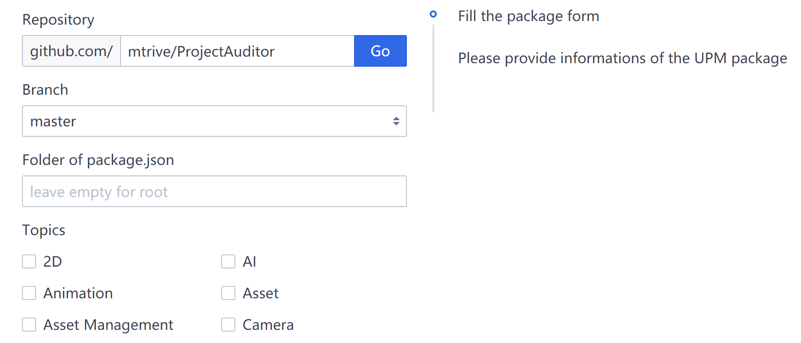

# 添加UPM软件包

## UPM软件包标准

OpenUPM要求软件包满足以下条件：
- 软件包名称应该符合[UPM命名约定](https://docs.unity.cn/cn/2020.2/Manual/cus-naming.html)
- 软件包应该符合[Unity使用条例](https://unity3d.com/legal/terms-of-service/software)和[软件包准则](https://unity3d.com/legal/terms-of-service/software/package-guidelines)。
- 软件包应该提供其描述的功能，并被测试过。
- 包含软件包信息的`package.json`文件，可以放置根路径下或任意的子文件夹中。
- 软件包应该使用开源许可证。建议从[spdx许可证列表](https://spdx.org/licenses/)中选择。
- 软件包需要被托管在Github上。
- 软件包应该通过Git标签进行版本控制，且符合[Semantic Versioning 语义式版本](https://semver.org/)的标准。例如`v1.1.0`，`1.1.0`，`1.1.1-preview`或`v2.0.0-preview.1`。建议使用[GitHub发行](https://help.github.com/en/github/administering-a-repository/creating-releases)页面或使用[持续集成工具](https://medium.com/openupm/how-to-maintain-upm-package-part-2-f352fbf5f87c)来创建含版本信息的Git标签。
- 软件包应该小于512MB。

## UPM代码仓库的文件结构

OpenUPM构建管线支持以下三种主流的UPM代码仓库结构。

- UPM软件包位于根路径下
- UPM软件包位于子文件夹中
- UPM软件包位于某一Git分支的子文件夹中

### UPM软件包位于根路径下

`package.json` 文件位于主分支的根路径，这是最简单的情况。

### UPM软件包位于子文件夹中

Git的主分支通常是一个Unity项目（带有Assets文件夹）。`package.json`文件位于子文件夹中, 例如`Assets/package-name`或者`Packages/com.namespace.package-name`。Git标签是基于主分支的。OpenUPM构建管线将检测`package.json`文件的位置，并对其进行正确处理。

### UPM软件包位于某一Git分支的子文件夹中

Git的主分支通常是一个Unity项目（带有Assets文件夹）。`package.json`文件位于子文件夹中，例如`Assets/package-name`或者`Packages/com.namespace.package-name`。该仓库另有一个`upm`分支，通常是使用`git subtree split/push`命令从主分支中修剪出的，目的是让`package.json`文件至于根目录下，并做一些特殊的准备工作（例如将`Samples`重命名为`Samples~`）。这样该`upm`分支就可以直接被Unity包管理器使用。这种结构下Git标签应基于upm分支，或者建立单独的`upm/x.y.z`Git标签，以便OpenUPM管线获取正确的信息。

## 软件包YAML文件

OpenUPM使用YAML文件存储软件包的元信息。例如：

```yaml
# 软件包名称
name: com.namespace.unitypackageexample
# 软件包显示名称
displayName: Unity Package Example
# 软件包说明
description: An unity package example
# 代码仓库网址
repoUrl: 'https://github.com/author/reponame'
# 分叉的父代码仓库网址
parentRepoUrl: null
# spdx许可证编号
licenseSpdxId: MIT
# 许可证名称
licenseName: MIT License
# 主题标签列表
topics:
  - utilities
# Git标签过滤前缀
gitTagPrefix: ''
# Git标签忽略正则表达式
gitTagIgnore: '-master$'
# 最小构建版本
minVersion: '1.0.5'
# 主图片
image: 'https://github.com/author/reponame/raw/master/path-of-img.png'
# 主图片缩放模式：cover (默认值) 或者 contain
imageFit: cover
# 自述路径
readme: 'master:README.md'
# 软件包猎手的GitHub用户名
hunter: author
```

## 使用软件包提交表单

软件包猎手可以使用[软件包提交表单](/packages/add/)来提交软件包的YAML文件。该表单将指导你填写所需的信息，生成YAML文件，然后在浏览器中生成合并请求（Pull Request）并提交到GitHub。

[](/packages/add/)

通过自动测试后，该PR会被自动合并。CI会做大量集成工作，包括更新网站并通知构建管线。大约10~15分钟后，你可以通过访问`/packages/com.namespace.package-name`网址，来查看软件包的详细信息页面，并通过该页面的【**版本**】和【**构建管线**】模块了解更多的构建结果。

```
+--------------+      +--------------+      +---------+
| Package Form | +--> | Pull Request | +--> | Wait CI |
+--------------+      +--------------+      +---------+
```

## 故障排除

### 处理没有Git标签的代码仓库

请在原作者的代码仓库中创建一个工单（Issue），以申请建立含有有效版本信息的Git标签。要了解如何使用GitHub Actions来自动化该过程，请参考[这篇英文教程](https://medium.com/openupm/how-to-maintain-upm-package-part-2-f352fbf5f87c)。

### 处理主分支和UPM分支的重复Git标签

代码仓库可能包含重复的版本标签。这可能是由CI工具创建的，一个用于主分支，另一个用于UPM分支。即

- `1.0.0`和`upm/1.1.0`
- `1.0.0`和`1.1.0-upm`
- `1.0.0-master`和`1.1.0-upm`

在这种情况下，来自UPM分支的标签具有更高的优先级，而另一个则被忽略。

### 处理失败的构建

你可以在软件包详细信息页面上的【**构建管线**】部分检查失败的原因。最常见的问题是**版本冲突/版本已存在**，这意味着你已经发布了具有相同版本号的软件包。这通常是由于忘记更新`package.json`文件的版本号造成的。软件包的作者需要更新该版本号，然后重新标记错误的Git标签。若OpenUPM检测到相关的Git标签已被重新标记，则构建管线将重新构建失败的版本。

然而，构建管线不会去重建已经成功发布的版本，即使是对应的Git标签被重新标记或删除。因为更改已经发行的版本是一种不被鼓励的行为，特别对于开放的软件仓库来说更是如此。如果打算修复一个Bug，建议软件包的作者通过提升版本号，并创建新的Git标签来修复该问题。

### 处理复合软件包仓库（Monorepos）

复合软件包仓库（Monorepos）在单个代码仓库中包含多个软件包。通常结构如下：

```
Packages/
  com.namespace.foo/
    package.json
  com.namespace.bar/
    package.json
```

复合软件包仓库（Monorepos）应提交多个软件包YAML到OpenUPM平台中。需要注意的是，
- 如果你为每个新版本，都提升所有软件包的版本号。那么它将可以正常工作。我们的构建管线将分别处理每个程序包提交，并找到相关的package.json进行处理。
- 如果你为某个单独的软件包发布新版本，但其他的软件包版本则保持不动，你需要使用一个Git标记的前缀来区分每个软件包。例如`com.namespace.bar/1.0.0`和`com.namespace.foo/1.0.0`。然后填写软件包YAML文件的`gitTagPrefix`字段。例如，软件包`com.namespace.bar`应该写入`gitTagPrefix: "com.namespace.bar/"`，以避免浪费构建管线的资源去构建实际上未更新的软件包。
