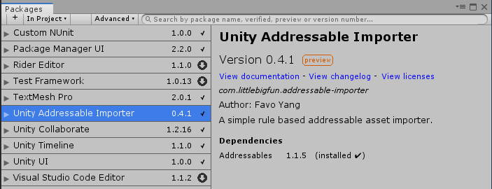
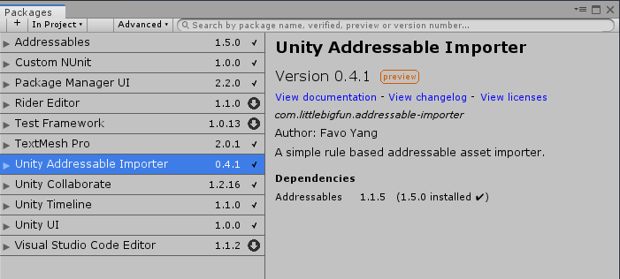

# OpenUPM-CLI快速入门

本文帮助你在终端中配置openupm-cli，并使用其安装和维护软件包。openupm-cli可以兼容常见的终端使用：
- Mac/Linux: Bash。
- Windows: [Git-Bash](https://gitforwindows.org/), CMD, 或者PowerShell。

::: tip 提示
如果你不习惯使用命令行，你仍然可以使用软件包页面提供的其他安装方式。
:::

## 安装OpenUPM-CLI

OpenUPM-CLI需要使用[Node.js 14或更高版本](https://nodejs.org/en/download/)。

让我们通过打印npm的版本，来验证是否安装好了Node.js。顺便一提，UPM（Unity包管理器）正是受到了NPM（Node包管理器）的启发。

```sh
$ npm -v
6.13.4
```

建议全局安装openupm-cli，以便你可以从任何路径使用它。

```sh
$ npm install -g openupm-cli
C:\Users\openupm\AppData\Roaming\npm\openupm -> C:\Users\openupm\AppData\Roaming\npm\node_modules\openupm-cli\bin\openupm + openupm-cli@1.14.0
C:\Users\openupm\AppData\Roaming\npm\openupm-cn -> C:\Users\openupm\AppData\Roaming\npm\node_modules\openupm-cli\bin\openupm-cn + openupm-cli@1.14.0
```

让我们通过打印openupm-cli的版本来验证是否安装成功。

```sh
$ openupm-cn --version
1.14.0
```

## 安装UPM软件包

下面我们创建一个新的Unity项目，将其保存在路径：`~/Document/projects/hello-openupm`.

让我们尝试安装一个软件包[Unity可寻址资源导入器](https://github.com/favoyang/unity-addressable-importer)，这是用于管理可寻址资源的程序包。首先，我们需要确切的软件包名称。如果你已经知道软件包的名称，你可以跳过这一步。

```sh
# 进入到unity项目文件夹
$ cd ~/Document/projects/hello-openupm

# 按关键字搜索软件包
$ openupm-cn search addressable
fast search endpoint is not available, using old search.
┌───────────────────────────────────────┬─────────┬───────────┬────────────┐
│ Name                                  │ Version │ Author    │ Date       │
├───────────────────────────────────────┼─────────┼───────────┼────────────┤
│ com.littlebigfun.addressable-importer │ 0.4.1   │ Favo Yang │ 2019-12-10 │
│ Unity Addressable Importer            │         │           │            │
└───────────────────────────────────────┴─────────┴───────────┴────────────┘
```

返回软件包名称 `com.littlebigfun.addressable-importer`。

让我们通过 `add` 指令来安装软件包。

```sh
$ openupm-cn add com.littlebigfun.addressable-importer
added: com.littlebigfun.addressable-importer@0.4.1
manifest updated, please open unity project to apply changes
```

返回软件包版本0.4.1已添加到软件包清单文件中。

::: tip 提示
你可以直接从[OpenUPM的软件包页面](/packages/com.littlebigfun.addressable-importer)获取安装指令。
:::

返回Unity编辑器，等待软件包管理器解析这次更改。 然后你将看到`com.littlebigfun.addressable-importer`出现在软件包管理器的窗口中。



我们还安装了依赖包`Addressbles`，但该软件包未在当前列表中显示。因为它还不是这个项目的直接依赖关系。如果要使用`Addressbles`的最新版本，则应在软件包管理的窗口中升级它的版本。当然，你也可以使用openupm-cli来升级版本。

```sh
$ openupm-cn add com.unity.addressables
added: com.unity.addressables@1.5.0
manifest updated, please open unity project to apply changes
```
返回到Unity编辑器，等待软件包管理器解析这次更改。然后你将看到最新版本的`Addressables`出现在软件包管理器窗口中。



::: warning 注意
openupm-cli仅帮助你安装软件包，及其依赖包。它不会直接帮助你下载tarball，这是Unity软件包管理的职责范围。
:::

## 了解软件包清单文件的变化

要了解软件包清单文件的更改，你可以打印出该JSON文件。

```json
$ cat Packages/manifest.json
{
  "dependencies": {
    ...
    "com.littlebigfun.addressable-importer": "0.4.1",
    "com.unity.addressables": "1.5.0"
  },
  "scopedRegistries": [
    {
      "name": "package.openupm.com",
      "url": "https://package.openupm.com",
      "scopes": [
        "com.littlebigfun.addressable-importer",
        "com.openupm"
      ]
    }
  ]
}
```

在刚才的操作中，openupm-cli将 `com.littlebigfun.addressable-importer` 和 `com.unity.addressables` 两者都添加到了`dependencies`中。它还修改了`scopedRegistries`以将`com.littlebigfun.addressable-importer`的命名空间与openupm软件包仓库连接在一起。

请访问[openupm-cli自述文件](https://github.com/openupm/openupm-cli#openupm-cli)了解更多用法。
